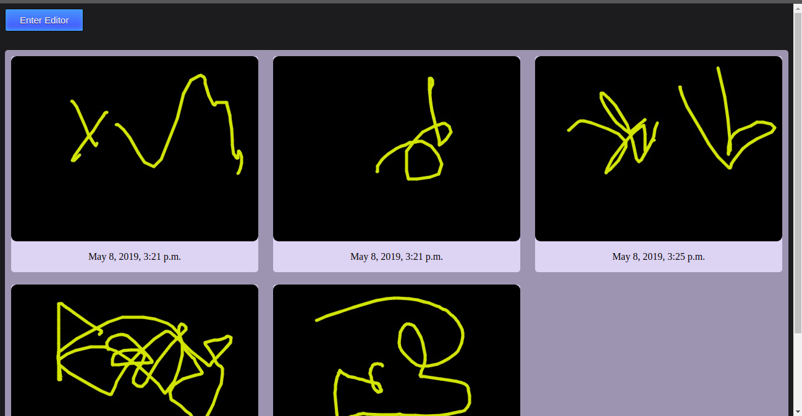

1. project run in localhost so you need to rename urls in mysite/settings.py
2. install mysql
3. pip install mysqlclient
4. pip install Django==2.2.1 
5. change mysite/mysqlcon.cnf based on your mysql database
6. python manage.py makemigrations paint
7. python manage.py migrate
8. python manage.py runserver
9. go to: http://127.0.0.1:8000/paint/ for 'Homepage'
10. go to: http://127.0.0.1:8000/admin/ for 'Adminpage' (dataset management)

---------------------------------------------------

